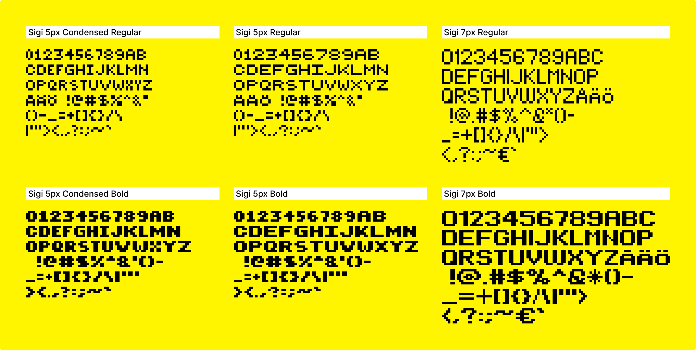

# Sigi pixel font

This is a font I designed in 2001.
It was served over a HTTP server as a GIF. At the time, the web did not support custom fonts, so the way you'd "spice things up" was to use images of text rather than actual text. When you had user-generated content, like a guest book where you couldn't possibly make every text people wrote in Photoshop into an image, Sigi was a useful service. You'd essentially do "sigi?font=5px&text=Hello" which would respond with a GIF of that text set in one of the fonts in this repository.



What you will find in this repository are JSON files of the fonts, converted from the original PHP source code. The structure of these JSON files should be fairly self-explanatory:

```js
{
  "name": "Sigi 5px Regular", // name of font
  "height": 5,                // height in "pixels"
  "glyphs": [                 // list of glyphs
    { // a glyph
      "name": "J",     // descriptive name
      "width": 5,      // width in "pixels"
      "codepoint": 74, // Unicode codepoint i.e. 74 = U+004A
      "coords":        // list of pixels (X,Y coordinates)
        [[0,3],[1,4],[2,4],[3,4],[4,0],[4,1],[4,2],[4,3]]
    },
    // ... more glyphs ...
  ]
}
```


The Sigi pixel fonts are essentially released into the public domain, under [CC0](LICENSE.txt).
